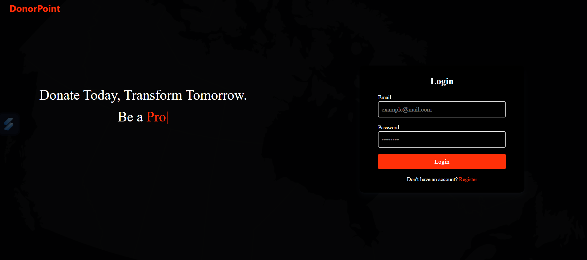
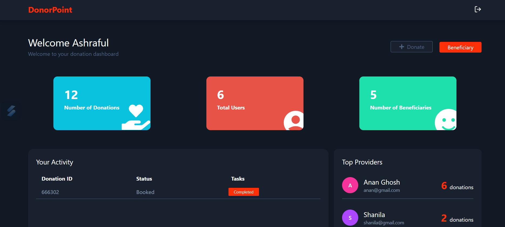
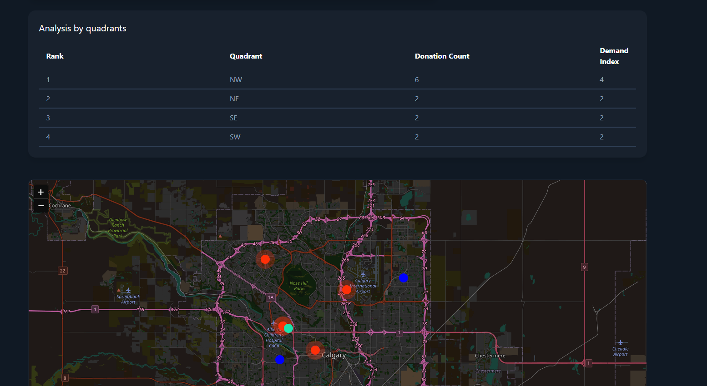
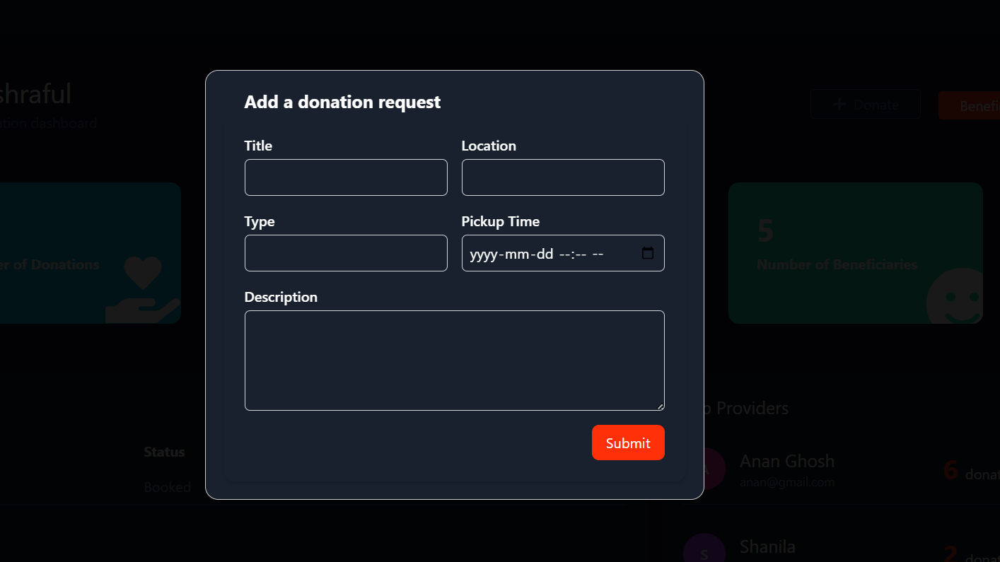
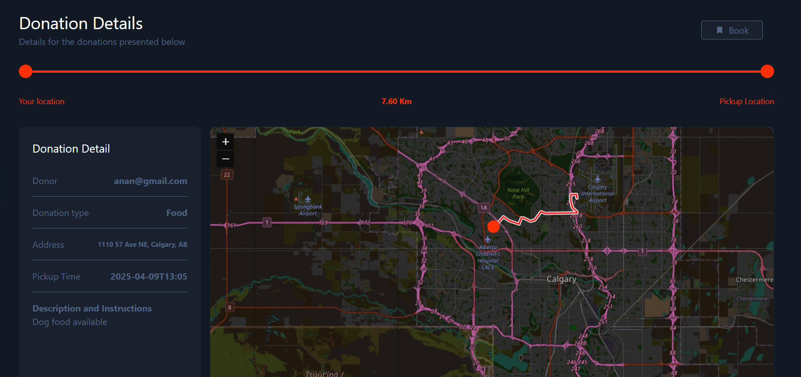

# DonorPoint Web Application

This project is a AI powered full stack web application built with a **React.js frontend** and a **Flask backend**. The app demonstrates a modern web architecture with a RESTful API layer, user authentication, real-time data utilization and use of other third party api's.

---

## 🧩 Project Structure

```
/project-root
│   ├── application.py  # Flask backend
    ├── assets
│   └── requirements.txt
│
├── donation_share_frontend/   # React frontend
│   ├── public/
│   ├── src/
│   ├── package.json
│   └── ...
│
└── README.md          # Project documentation
```

---

## ⚙️ Setup Instructions

### 1. Clone the Repository

```bash
git clone https://github.com/Ashraf-Raneem/Donation-share
cd Donation-share
```

---

### 2. Backend Setup (Flask)

```bash
cd backend
python -m venv venv
source venv/bin/activate  # On Windows: venv\Scripts\activate
pip install -r requirements.txt

set FLASK_APP = application.py
# Run the Flask server
flask run
```

> The Flask server will start on `http://localhost:5000`

---

### 3. Frontend Setup (React)

```bash
cd donation_share_frontend
npm install

# Run the React development server
npm start
```

> The React app will start on `http://localhost:3000`

---

## 🔄 Connecting Frontend to Backend

The React app makes API calls to the Flask backend via `http://localhost:5000/api/`. Make sure both servers are running simultaneously. The url is added as a proxy variable in package.json file.

---

## 🧠 Core Functionality

- ✅ **User Authentication**
  - Sign up / Login
  - JWT token handling
  - Session persistence

- 📡 **API Data Handling**
  - Fetch and submit data from/to Flask via REST API
  - Error handling and loading states

- 🗺️ **Geolocation & Real-Time Features**
  - Access and use geolocation API

- 📊 **Dashboard & UI**
  - Data visualization and user-friendly interface
  - Conditional rendering based on authentication
  - Mapping frontend using leaflet

- 🗺️ **Use of LLM's**
  - Use of Gemini API for getting insights on donation locations   
---

## 📡 APIs Used

Here are the major endpoints available in the Flask backend:

| Method | Endpoint               | Description                         |
|--------|------------------------|-------------------------------------|
| POST   | `/register`            | Register a new user                 |
| POST   | `/login`               | Authenticate and return JWT         |
| GET    | `/users`               | Get all the users in database       |
| GET    | `/receivers`           | Get all users collecting donation   |
| POST   | `/donations`           | Creates new donation requests       |
| GET    | `/donations`           | Gets all donation data              |
| GET    | `/donations/:id`       | Gets unique donation data           |
| GET    | `/receivers/:id`       | Gets unique receivers data          |
| GET    | `/user_activity/:user` | Gets unique user activity data      |
| GET    | `/top_donors`          | Ranks all the highest donors        |
| POST   | `/book/:id`            | Book a unique donation              |
| POST   | `/complete/:id`        | Complete a unique donation          |
| GET    | `/analyze_quadrant`    | Gets analysis on region using AI    |
| WS     | `/ws/location`         | (Optional) Real-time data stream    |

---

## 📦 Tech Stack

- **Frontend**: React.js, Axios, React Router, Tailwind, Leaflet etc
- **Backend**: Flask, Flask-JWT, SQLAlchemy, PostgreSQL
- **Real-time** Geolocation API
- **Authentication**: JSON Web Tokens (JWT)
- **AI**: Gemini API

---

## Screenshots

**Authentication**


**Home**



**Donation Form**


**Donation Detail**



## 📄 License

MIT License © [Your Name]
